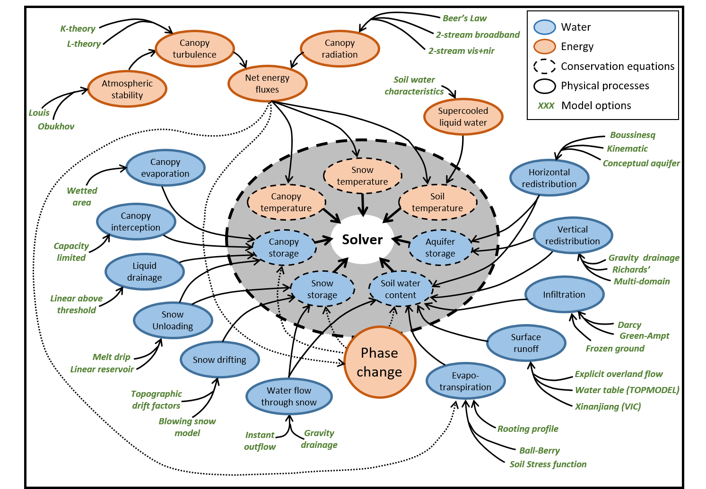
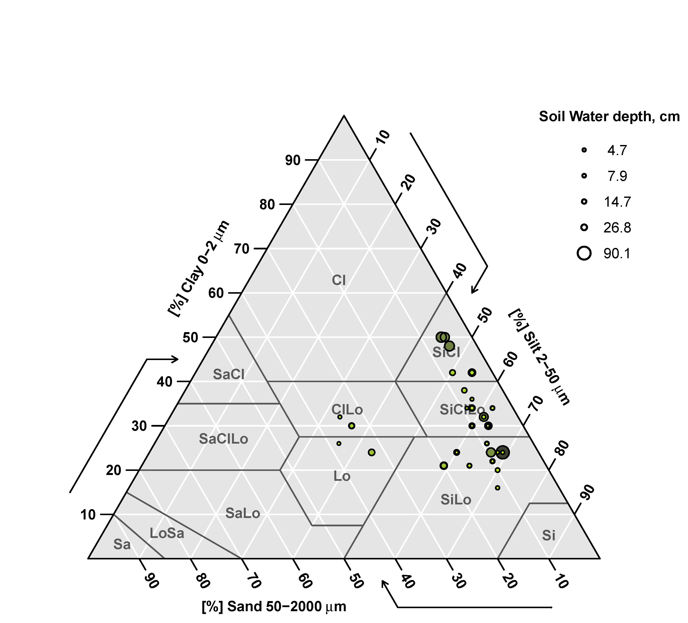
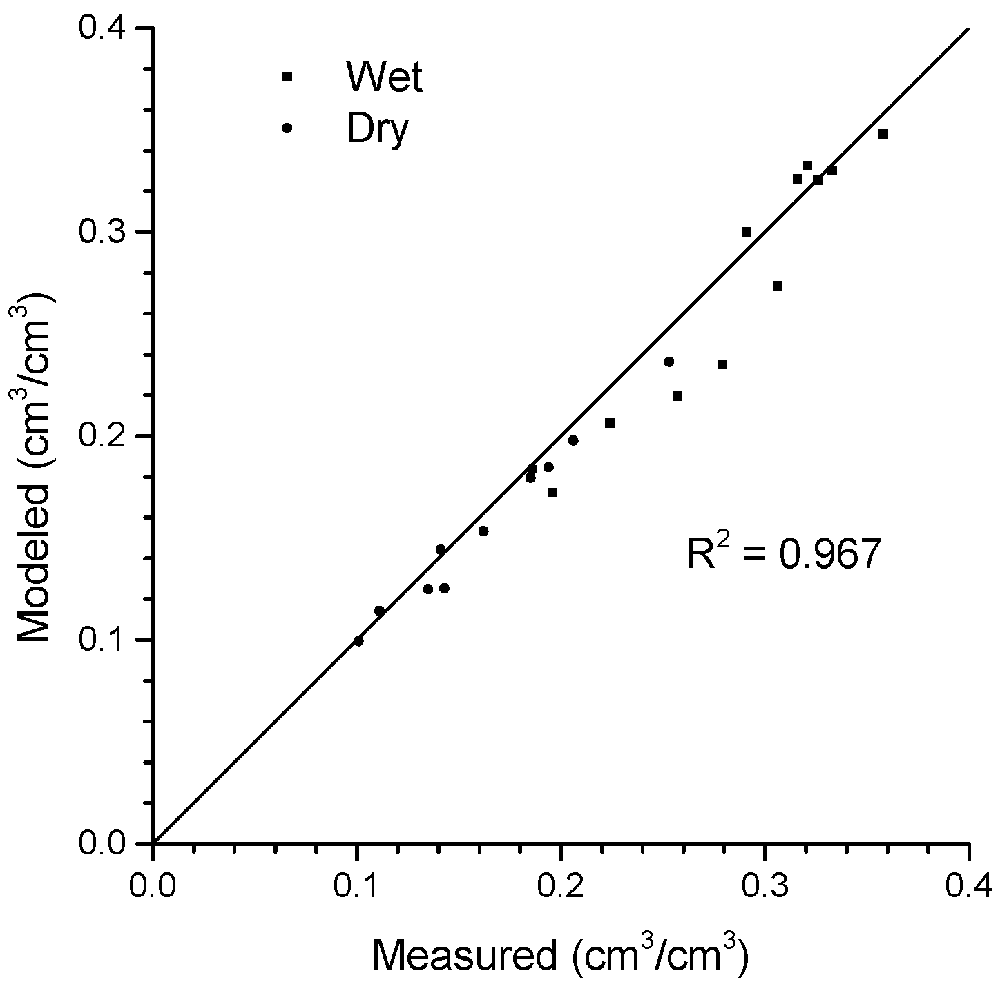

```{r setup, include=FALSE}
knitr::opts_chunk$set(echo = TRUE)
```
------

## Abstract
**TODO: abastract**

part1: some introduction

part2: what I do

part3: results showing what

part4: concluding 

<!--- selected different parameterization / different spatial discretizations / different forcing dataset) --->
<!---
The simulation results are compared to simulations with the Variable Infiltration Capacity (VIC) model and the Precipitation Runoff Modeling System (PRMS). We are particularly interested in SUMMA’s capability to mimic model behaviors of the other two models through the selection of appropriate model parameterizations in SUMMA.
--->

## 1 Introduction
Hydrologic modeling involves a series of decisions made by the model developers, ranging from data preparation, conceptulization, and numerical solutions and so on [@clark_unified_2015]. 
Though these decisions are such important that can greatly impact or even determine the modeling performance, besides data limitation and modeling purposes, these decisions made by hydrologic model developers are also largely dependent on model developers' intuition and previous experience. Therefore, a variety of models have been developed in the past few decades. They, on one hand, provide options for particular modeling area and purpose. 
On the other hand, testing model decisions is made an emerging enormous challenge as data, process rerpersentation, and numeirc methods have been becoming increasingly available.
This underlines the need of a tool that can flexibily specify different model decisions such as process representation, spatial architecture and numerical solver during the modeling process to systematically and effectively examine these decisions.

The Structure for Unifying Multiple Modeling Alternatives (SUMMA) model was developed by Clark et al. [-@clark_unified_2015; -@clark_unified_2015-1] for tackling such chanllenges by providing a unified approach to process-based hydrologic modeling.  purpose. general apporach

SUMMA has been under active ongoing development by the developer team. what have done (applications in clark2015a,b) . only point/field application [@clark_unified_2015-1]. It is important to evaluate the capability of SUMMA for large domain applications. Particularly, we are interested in SUMMA's flexibility of spatial 

```
(TODO: breif introduction for Columbia River Basin?)
```

Our objective of this study is to demonstrate the first long-term and large-domain application of SUMMA, specifically to the Columbia River Basin (CRB), as well as the flexibility of SUMMA in a real case study. The CRB model is driven by the hourly forcing data for the simulation period between 1915 and 2011. We conducted two model experiments with the CRB model. In the first experiment, the CRB is discretized into 1/16 degree cell-based grid as well as HRU-based grids to test SUMMA's capability of different spatial structures. `**TODO** the options are used to test its impact on the runoff?/snow?`. A brief introduction of SUMMA is given in Section 2. The description of model setups is provided in Section 3. The simulated results are compared to the observations and 


## 2 SUMMA Model Description

land surface water and energy Conceptualization and model decisions (figure 3 of clark2015a) 

four domains of critical zone: canopy, snow, soil, aquifer



hydrology equations

energy equations

model decisions
A table shows the decisions provided in SUMMA and the decisions selected in the CRB model.
```
soilCatTbl  ROSETTA         ! (03) soil-category dateset
vegeParTbl  MODIFIED_IGBP_MODIS_NOAH            ! (04) vegetation category dataset
soilStress  NoahType        ! (05) choice of function for the soil moisture control on stomatal resistance
stomResist  BallBerry       ! (06) choice of function for stomatal resistance
num_method  itertive        ! (07) choice of numerical method
fDerivMeth  analytic        ! (08) method used to calculate flux derivatives
LAI_method  specified       ! (09) method used to determine LAI and SAI
f_Richards  mixdform        ! (10) form of Richard's equation
groundwatr  qTopmodl        ! (11) choice of groundwater parameterization
hc_profile  pow_prof        ! (12) choice of hydraulic conductivity profile
bcUpprTdyn  nrg_flux        ! (13) type of upper boundary condition for thermodynamics
bcLowrTdyn  zeroFlux        ! (14) type of lower boundary condition for thermodynamics
bcUpprSoiH  liq_flux        ! (15) type of upper boundary condition for soil hydrology
bcLowrSoiH  zeroFlux        ! (16) type of lower boundary condition for soil hydrology
veg_traits  CM_QJRMS1998    ! (17) choice of parameterization for vegetation roughness length and displacement height
canopyEmis  difTrans        ! (18) choice of parameterization for canopy emissivity
snowIncept  lightSnow       ! (19) choice of parameterization for snow interception
windPrfile  logBelowCanopy  ! (20) choice of wind profile through the canopy
astability  louisinv        ! (21) choice of stability function
canopySrad  BeersLaw        ! (22) choice of canopy shortwave radiation method
alb_method  varDecay        ! (23) choice of albedo representation
compaction  anderson        ! (24) choice of compaction routine
snowLayers  CLM_2010        ! (25) choice of method to combine and sub-divide snow layers
thCondSnow  tyen1965        ! (26) choice of thermal conductivity representation for snow
thCondSoil  funcSoilWet     ! (27) choice of thermal conductivity representation for soil
spatial_gw  localColumn     ! (28) choice of method for the spatial representation of groundwater
subRouting  timeDlay        ! (29) choice of method for sub-grid routing
```

## 3 Data and Model Experiment

#### 3.1 Parameters

In the CRB model, the land cover distribution is specified based on the 2001 National Land Cover Database developed by @homer_completion_2007. In the CRB, there are primarily **n** different types of land covers (figure **N**). The majority of the basin is covered by (used for) **TYPE**. 

```
**TODO** distribution of land covers
```

```
**TODO** Table showing parameters associated with land cover
```

soil (SUGGRO data set) 



```
**TODO** Table showing parameters associated with soil
```

Soil hydraulic properties calculated based on pedotransfer functions



Other parameters


#### 3.2 Forcing Data
The atmospheric forcing data for driving SUMMA include precipitation, air temperature, air pressure, specific humidity, wind speed, incoming shortwave and longwave radiations. The time step of the forcing data is artitrary but in this study, an hourly time step is used. The hourly forcing data is derived from a 1/16 degree forcing data set, including the daily precipitation, minimum and maximum temperature as well as wind speed developed by @livneh_long-term_2013. The daily forcing dataset is further disaggregated to an hourly intervel using the Mountain MicroClimate simulator (MTCLIM) [@united_states_department_of_agriculture_forest_service_mtclim:_1989; @kimball_improved_1997; @thornton_improved_1999]. Meanwhile, the hourly air pressure, specific humidity, and incoming shortwave and longwave radiation are also derived with MTCLIM. For the HRU-based discritization, the forcing data are averaged based on their areas interceted with the HRUs. To improve the IO efficiency and reduce storage, the forcing data are saved in the netCDF format.


#### 3.3 Model Experiment
In this study, two modeling experiments are conducted with SUMMA. These two expriments are used to test the fexibility of SUMMA in differnt aspects naming the spatial structure and process parameterization, respectively. 

In the first experiment, the CRB is discretized into a 1/16 degree grid and a hru-based grid. The 1/16 degree cell-based grid is aligned with the grid used by Blinved's. There are 23XXX active grid cells in the CRB. The cell-based grids are the primari spatial structure used in land surface models [@liang_simple_1994; @dai_common_2003] and hydrologic models [@wigmosta_distributed_1994]. The advantage of cell-based grids are 1. easy to develop 2. most used format in many data [@cosgrove_real-time_2003]. On the other hand, a HRU-bsed grid is developed baed on United State Geologic Survey Geospatial Fabric [@viger_gis_2014; @viger_preliminary_2014]. AS a result, there are 11723 HRUs in the CRB. The HRU-bsed grid is another popular discritization used in many other hydrologic models [@markstrom_prms-iv_2015; @neitsch_soil_2002]. It assumes that hydrologic features such as the land cover, topography, and subsurface characteristics are uniformly distributed in the HRU unit. Unlike the uniform size used ib the cell-based grid, the HRU size is determined sololy by the hydrologic features. Therefore, the HRU-based grid is superior to the cell-based grid in more precise representation of hydrologic characteristics. In fact, however, a grid cell can be considered as a special case of a HRU. Grouped Response Units (GRU) are intrduced In SUMMA to represent a collection of contiguous HRUs. The runoff of each HRU is summarized to its parent GRU and eventually routed to the stream network from the GRU. In both spatial structures, GRUs are used to represent the subbasins.     

```
**TODO**: a figure showing HRU and Cell (A HRU can be bigger or smaller than a Cell)
```

In the second experiment, 
`**TODO**: discuss with Martyn on what modeling decision to test in CRB (snow melt?)`

```
**TODO**: a figure showing snow cover change in columbia river basin ()
```

computational implementation

## 3 Results and Discussion

Temperature, snow, evaporation, surface runoff compared with VIC and Observed?
Impact of spatial discretization (more important for routing?)
Impact of different baseflow parameterization


## 4 Conclusion
Summary of the paper, future study

<!--- figures --->
 
<!--- reference --->
[link1]: http://example.com/ "Homer, C., Dewitz, J., Fry, J., Coan, M., Hossain, N., Larson, C., McKerrow, A., VanDriel, J.N., Wickham, J., 2007. Completion of the 2001 National Land Cover Database for the Conterminous United States. Photogrammetric Engineering and Remote Sensing 73."

## References

